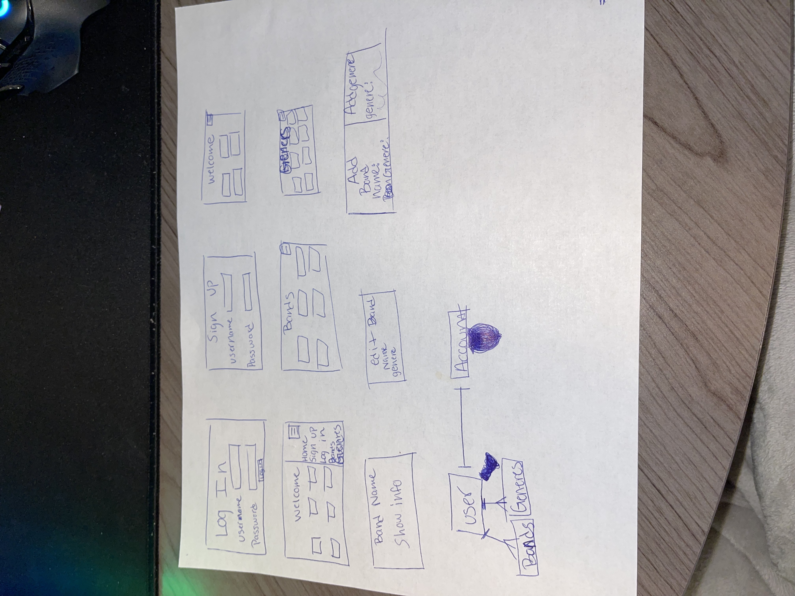
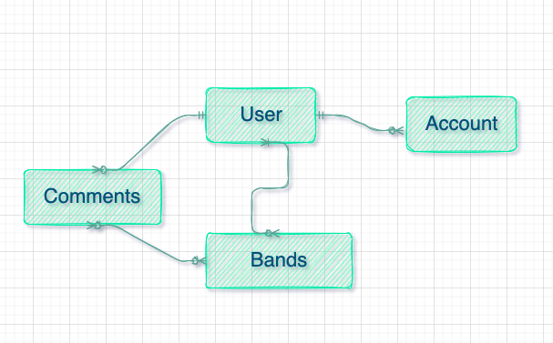

# Bands and Music App

As someone who loves music, it seems hard to find good music. So I wanted to make something that everyone can contribute into and find new music and add music that they enjoy so that others can enjoy too. 

## Seed used: 

startingBands = {
    {name: 'Nirvana', albums: 18, genre: 'alternative rock'},
    {name: 'Sublime', albums: 9, genre: 'Reggae rock', 'ska punk'},
    {...},
    {...},
    {...},
    {...},
    {...},
    {...},
    {...},
    {...},
}

startingGenres = {
    {genre: 'Alterative Rock'},
    {genre: 'Reggae Rock'},
    {genre: 'Ska Punk'},
    {...},
    {...},
    {...},
    {...},
    {...},
    {...},
    {...},
}

## User Stories: (As a user...)

- Create an account
    - music/sign-up
    - create a unique username (unique: )
    - redirect to log in page (redirect)
- Log in to an account
    - music/log-in
    - create a password
    - redirect to home page(redirect)
- Be able to create a band
    - create new schema
    - create a model to use
    - return newly created bands
    - query all bands in collection - find()
    - return all bands
- Be able to see all bands on homepage
    - query all bands (find())
    - show page for all bands
- See a single band
    - query for single band (findOne())
    - show page for single band
- Be able to Edit a bands information
    - query for one band (findOne())
    - show editing page with the id of the band
- Be able to see genres 
    - query for id of genre (find())
    - show page for genre 
    - show bands matching that genre 
- Be able to have a navagation bar 
    - Home
    - Log in 
    - Sign up
    - Bands
    - Genres
- Be able to update a band 
    - query for one band (findOne())
    - show update page
    - return updated band
    - show band with newly updated band
- Be able to add a comment on bands
    - Query for one band (findOne())
    - add comment form to bottom of show page 
    - return band show page with comment
    - be able to delete comment

# Schemas 

const userSchema {
    username: {
        type: String,
        required: true,
        unique: true
    },
    password: {
        type: String,
        required: true
    }
}

bandSchema {
    name: {
        type: String,
    }
    albums: {
        type: number
    }
    genres: {
        type: [String]
    }
}

commentSchema {
    comment: {
        type: String,
        required: true
    },
    author: {
        type: objectId
        ref: 'User'
    }
}, {
    timestamps: true
}

# Wire Frames & ERD

 

